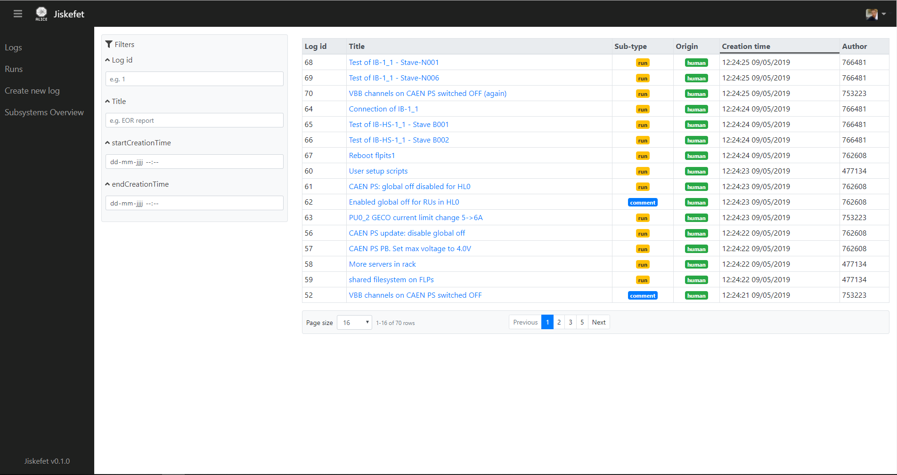
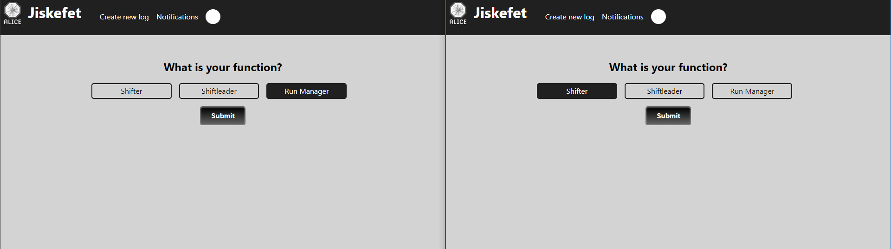
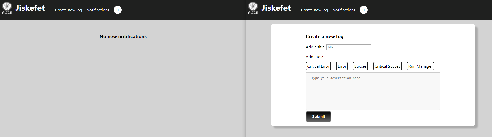
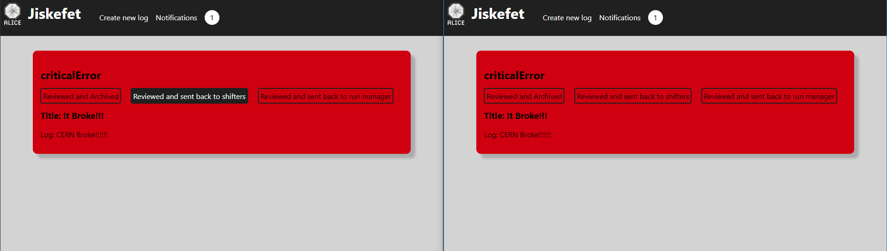

# project-3-1819

## Introduction
In this assignment from CERN I had three days to come up with a solution to one of the user stories provided. I chose a combination of two of those and added some extra sugar.

## Table of Contents

- [User Stories](#user-stories)
- [Current State](#current-state)
- [My Solution](#my-solution)
  - [Concept](#concept)
  - [Sketches](#sketches)
  - [Product](#product)

## User Stories
There are a couple of user stories that I used. Below they are presented from most important to least important concerning my application.

1. As a user I want certain messages to be pushed as notifications so I don't have to refresh the page. (websocket/backend)
2. As a user I want to receive notifications via alerts/flshcards so I can easily receive notifications without using sreen real estate.
3. As a user I want a simple but user friendly way to add or change tags so logs and threads are easier to filter/search through.

## Current State
[This is the current state](http://cmd.jiskefet.io/) of the application. I thought it missed a lot of design. 

## My Solution
### Concept

Apart from the design I think the current application also misses a good system for communication. The data is really cluttered and I could imagine that not everybody has to see all the notifications all the time. Different people who work there have different functions and stand in different spots in hierarchy. Also if you would work with different kinds of tags for logs, you could make sure that logs  with particular tags are sent to people with particular jobs. This way those people don't get notification overloaded.

#### Product

